# Xổ số Miền Nam (XSMN) Analysis

Sử dụng GitHub Action để tự động hoá thu thập và phân tích kết quả xổ số miền Nam hàng ngày.

Dự án này dựa trên [khiemdoan/vietnam-lottery-xsmb-analysis](https://github.com/khiemdoan/vietnam-lottery-xsmb-analysis), chuyển đổi từ XSMB sang XSMN.

## Hướng dẫn sử dụng

### Cài đặt trên máy cá nhân

```bash
git clone https://github.com/t-k-minh/vietnam-lottery-xsmb-analysis.git
cd vietnam-lottery-xsmb-analysis
uv sync --frozen --no-dev
uv run src/run.py
```

### Câu lệnh chạy hàng ngày

```bash
uv run src/run.py
```

Script sẽ tự động:
1. Nhận diện đài nào quay hôm nay theo lịch
2. Fetch kết quả mới nhất từ minhngoc.net.vn
3. Tạo biểu đồ phân tích
4. Cập nhật README.md

### GitHub Actions (tự động)

Workflow chạy mỗi ngày **17:30** giờ Việt Nam. Không cần làm gì — dữ liệu tự cập nhật.

### Tải dữ liệu

```python
import pandas as pd
df = pd.read_csv('https://raw.githubusercontent.com/t-k-minh/vietnam-lottery-xsmb-analysis/refs/heads/main/data/hcm.csv')
```

## Lịch quay

| Thứ | Các đài |
|------|---------|
| Thứ 2 | TP. HCM, Đồng Tháp, Cà Mau |
| Thứ 3 | Bến Tre, Vũng Tàu, Bạc Liêu |
| Thứ 4 | Đồng Nai, Cần Thơ, Sóc Trăng |
| Thứ 5 | Tây Ninh, An Giang, Bình Thuận |
| Thứ 6 | Vĩnh Long, Bình Dương, Trà Vinh |
| Thứ 7 | TP. HCM, Long An, Bình Phước, Hậu Giang |
| Chủ nhật | Tiền Giang, Kiên Giang, Đà Lạt |

## Kết quả xổ số mới nhất


### An Giang (09-07-2026)

| Giải | Kết quả |
| :--- | :------ |
| Đặc biệt | **622936** |
| Giải nhất | 15860 |
| Giải nhì | 28251 |
| Giải ba | 38344, 93766 |
| Giải tư | 47742, 54035, 25932, 83121, 03597, 29534, 04726 |
| Giải năm | 03388 |
| Giải sáu | 5921, 8134, 7068 |
| Giải bảy | 907 |
| Giải tám | 06 |

<details>
<summary>Xem phân tích</summary>

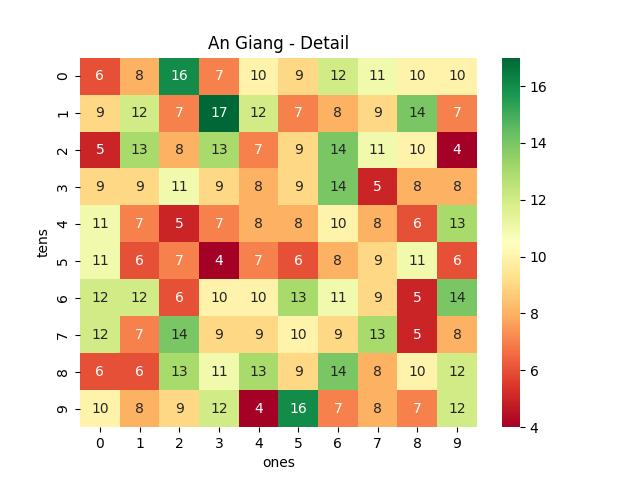

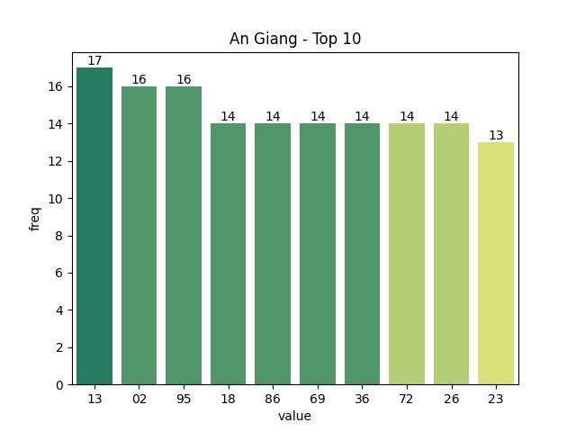

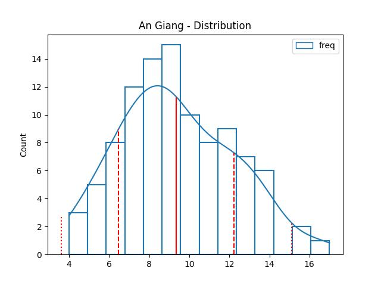

</details>

---

### Bình Dương (10-07-2026)

| Giải | Kết quả |
| :--- | :------ |
| Đặc biệt | **663795** |
| Giải nhất | 26361 |
| Giải nhì | 05911 |
| Giải ba | 14613, 73129 |
| Giải tư | 21603, 02774, 76628, 00405, 02429, 75680, 03202 |
| Giải năm | 06650 |
| Giải sáu | 0442, 0711, 6702 |
| Giải bảy | 638 |
| Giải tám | 63 |

<details>
<summary>Xem phân tích</summary>

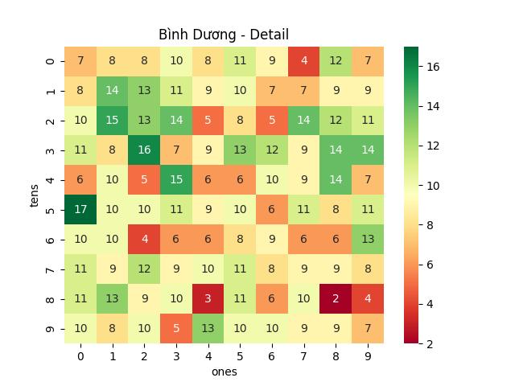

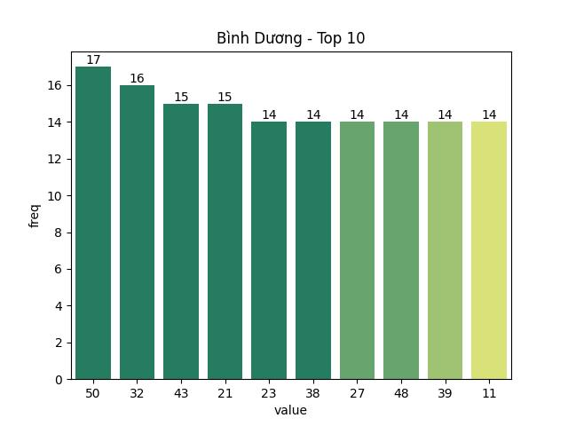

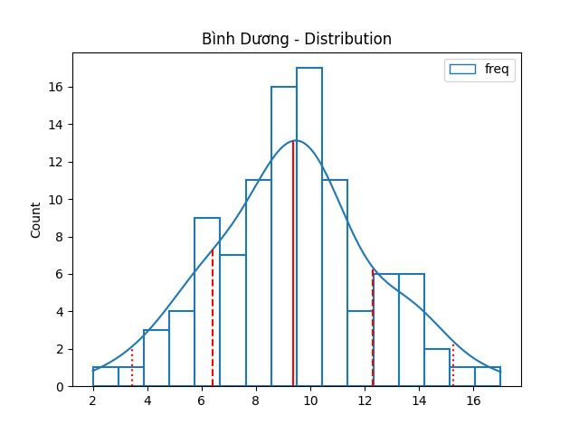

</details>

---

### Bình Phước (11-07-2026)

| Giải | Kết quả |
| :--- | :------ |
| Đặc biệt | **087990** |
| Giải nhất | 95576 |
| Giải nhì | 72550 |
| Giải ba | 48388, 92355 |
| Giải tư | 65233, 32508, 59867, 90453, 79152, 90939, 90937 |
| Giải năm | 00877 |
| Giải sáu | 7390, 5458, 4974 |
| Giải bảy | 715 |
| Giải tám | 96 |

<details>
<summary>Xem phân tích</summary>

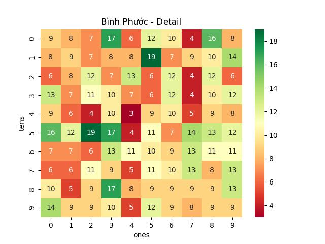

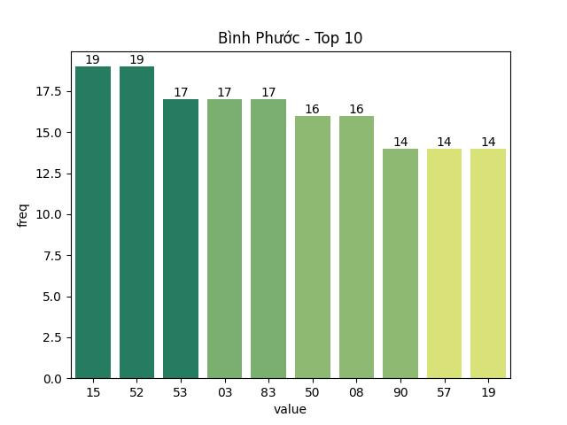

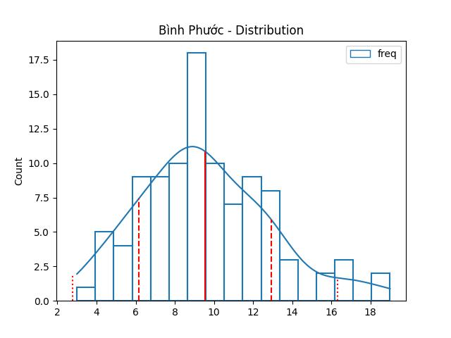

</details>

---

### Bình Thuận (09-07-2026)

| Giải | Kết quả |
| :--- | :------ |
| Đặc biệt | **763530** |
| Giải nhất | 32946 |
| Giải nhì | 23369 |
| Giải ba | 47742, 34981 |
| Giải tư | 79965, 57609, 91542, 52404, 96779, 74905, 62259 |
| Giải năm | 05324 |
| Giải sáu | 1786, 6328, 5235 |
| Giải bảy | 362 |
| Giải tám | 36 |

<details>
<summary>Xem phân tích</summary>

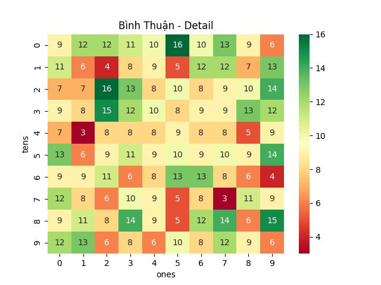

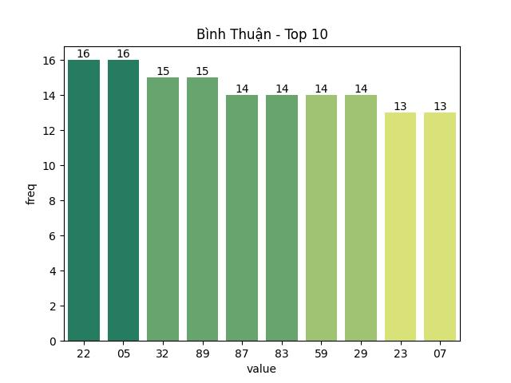

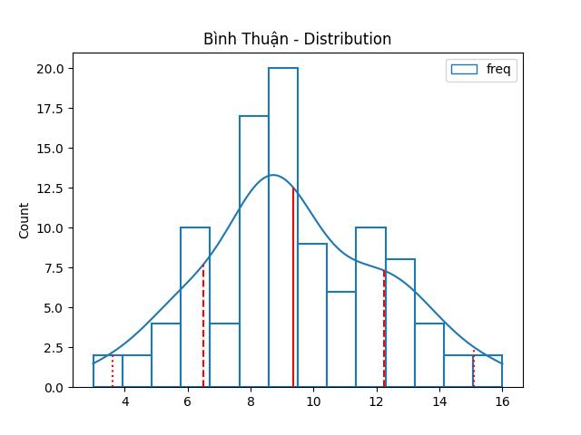

</details>

---

### Bạc Liêu (07-07-2026)

| Giải | Kết quả |
| :--- | :------ |
| Đặc biệt | **709492** |
| Giải nhất | 93146 |
| Giải nhì | 42513 |
| Giải ba | 80482, 76768 |
| Giải tư | 83703, 71807, 16405, 33975, 64086, 18977, 35001 |
| Giải năm | 07253 |
| Giải sáu | 4780, 4696, 6440 |
| Giải bảy | 776 |
| Giải tám | 15 |

<details>
<summary>Xem phân tích</summary>

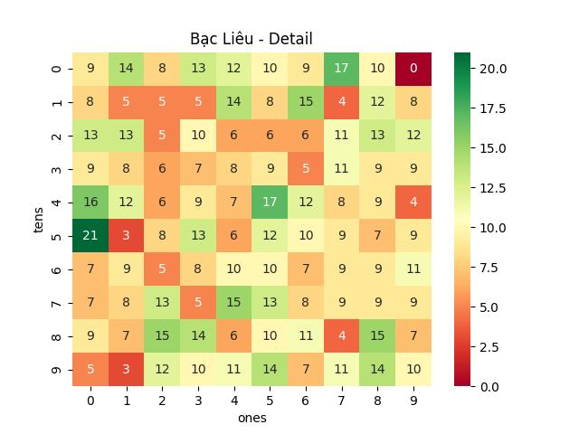

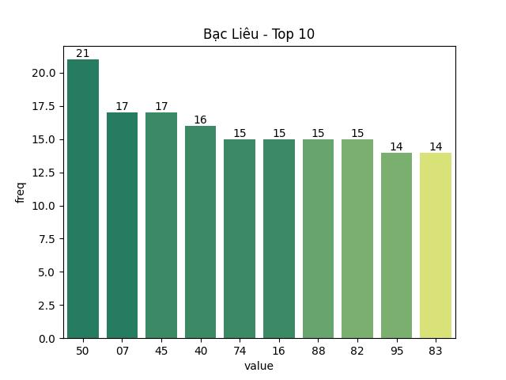

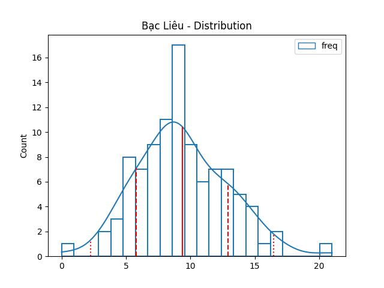

</details>

---

### Bến Tre (07-07-2026)

| Giải | Kết quả |
| :--- | :------ |
| Đặc biệt | **877777** |
| Giải nhất | 59078 |
| Giải nhì | 00083 |
| Giải ba | 74773, 87723 |
| Giải tư | 31096, 91065, 09745, 19481, 41878, 39406, 99838 |
| Giải năm | 07271 |
| Giải sáu | 1669, 4092, 7478 |
| Giải bảy | 639 |
| Giải tám | 05 |

<details>
<summary>Xem phân tích</summary>

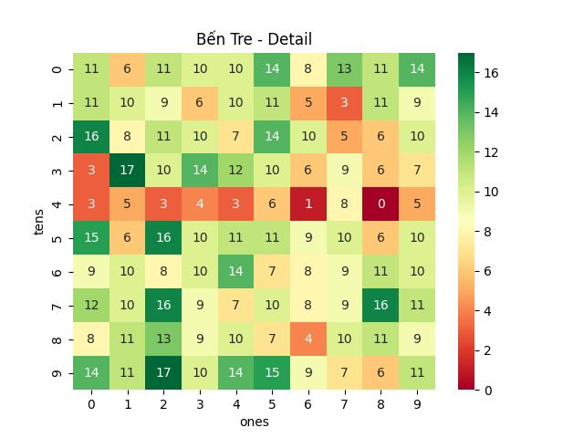

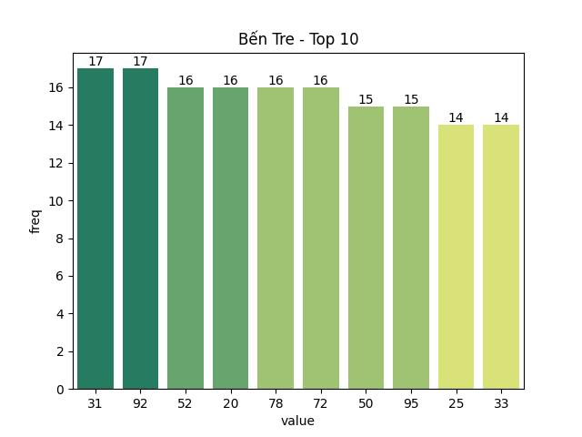

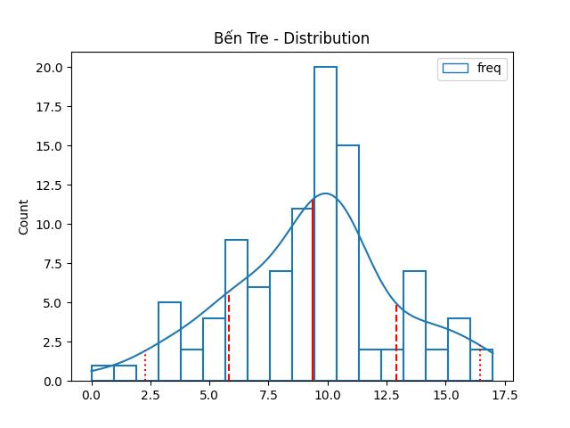

</details>

---

### Cà Mau (06-07-2026)

| Giải | Kết quả |
| :--- | :------ |
| Đặc biệt | **738323** |
| Giải nhất | 10652 |
| Giải nhì | 49279 |
| Giải ba | 99982, 58550 |
| Giải tư | 48183, 50157, 50142, 79923, 83730, 56983, 75590 |
| Giải năm | 01204 |
| Giải sáu | 2607, 7332, 0081 |
| Giải bảy | 081 |
| Giải tám | 46 |

<details>
<summary>Xem phân tích</summary>

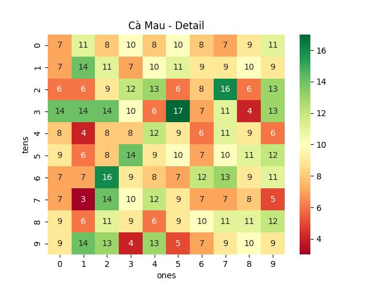

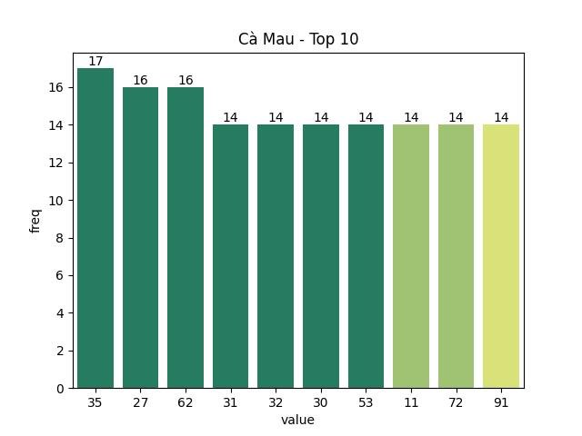

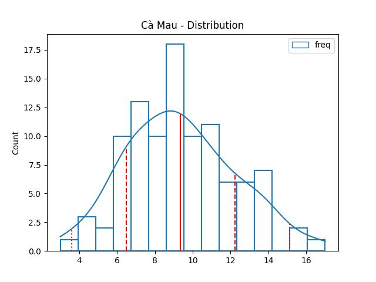

</details>

---

### Cần Thơ (08-07-2026)

| Giải | Kết quả |
| :--- | :------ |
| Đặc biệt | **214463** |
| Giải nhất | 37814 |
| Giải nhì | 38961 |
| Giải ba | 81701, 89733 |
| Giải tư | 15745, 90096, 17661, 80852, 53410, 72295, 94913 |
| Giải năm | 02659 |
| Giải sáu | 4415, 2927, 9735 |
| Giải bảy | 179 |
| Giải tám | 68 |

<details>
<summary>Xem phân tích</summary>

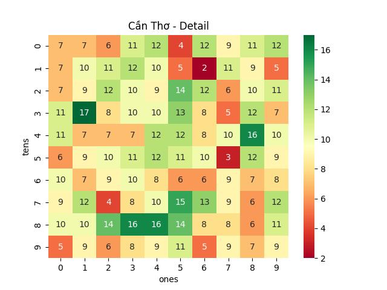

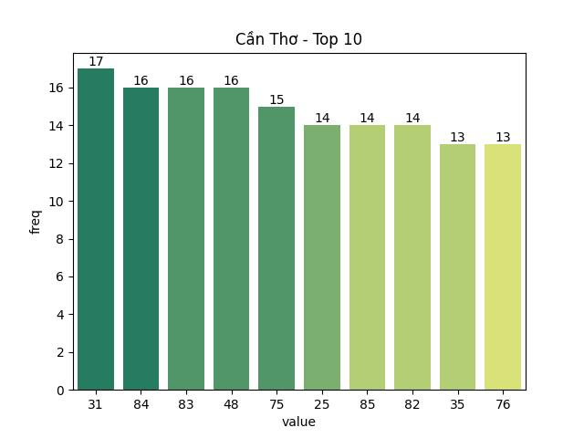

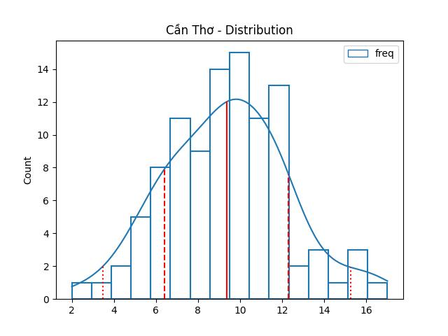

</details>

---

### Hậu Giang (11-07-2026)

| Giải | Kết quả |
| :--- | :------ |
| Đặc biệt | **883669** |
| Giải nhất | 31090 |
| Giải nhì | 31751 |
| Giải ba | 81554, 12774 |
| Giải tư | 89656, 91993, 15853, 84749, 44227, 79836, 46711 |
| Giải năm | 01022 |
| Giải sáu | 6295, 1631, 4903 |
| Giải bảy | 821 |
| Giải tám | 45 |

<details>
<summary>Xem phân tích</summary>

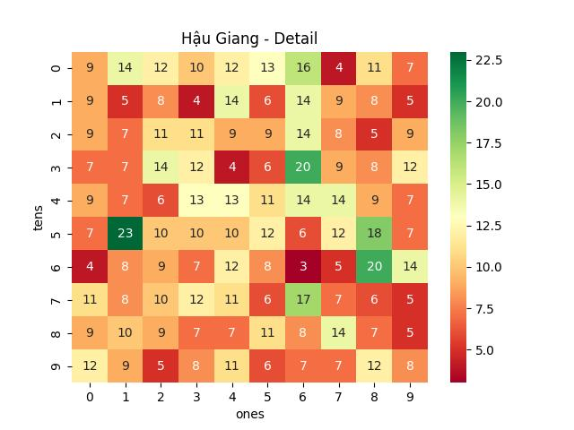

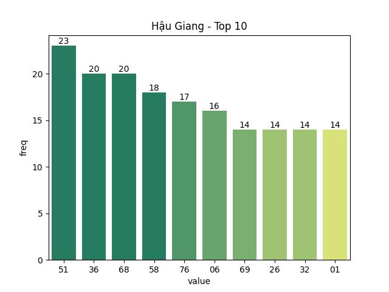

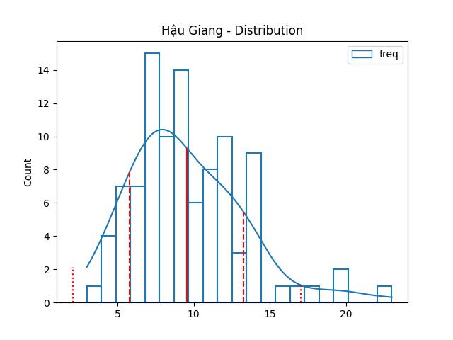

</details>

---

### Kiên Giang (12-07-2026)

| Giải | Kết quả |
| :--- | :------ |
| Đặc biệt | **913490** |
| Giải nhất | 05117 |
| Giải nhì | 43178 |
| Giải ba | 28938, 00448 |
| Giải tư | 08116, 22527, 47561, 86576, 22291, 23493, 46016 |
| Giải năm | 07846 |
| Giải sáu | 8335, 7796, 0344 |
| Giải bảy | 455 |
| Giải tám | 99 |

<details>
<summary>Xem phân tích</summary>

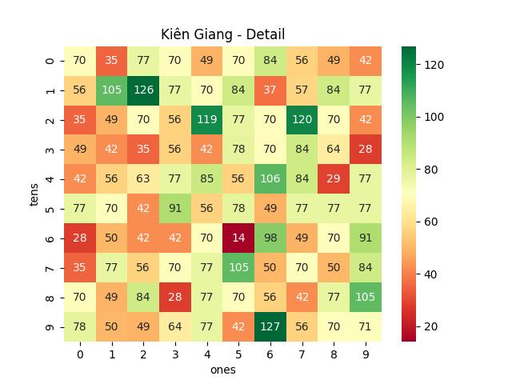

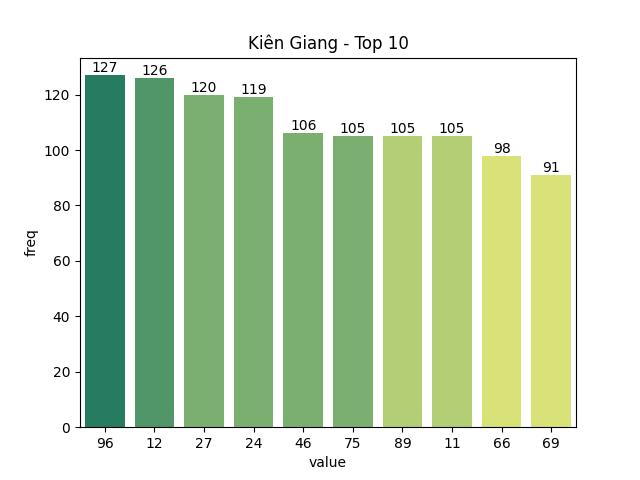

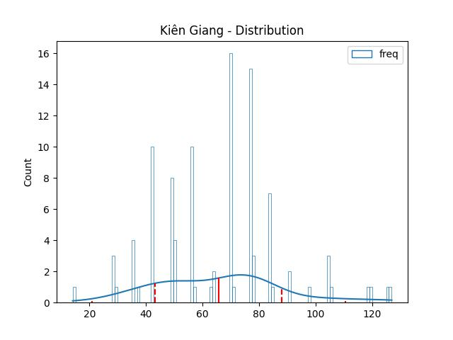

</details>

---

### Long An (11-07-2026)

| Giải | Kết quả |
| :--- | :------ |
| Đặc biệt | **016397** |
| Giải nhất | 76759 |
| Giải nhì | 91688 |
| Giải ba | 49183, 16713 |
| Giải tư | 72738, 30463, 88865, 28434, 84625, 59731, 07730 |
| Giải năm | 09678 |
| Giải sáu | 1974, 4792, 5347 |
| Giải bảy | 565 |
| Giải tám | 28 |

<details>
<summary>Xem phân tích</summary>

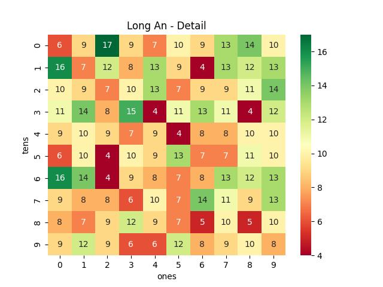

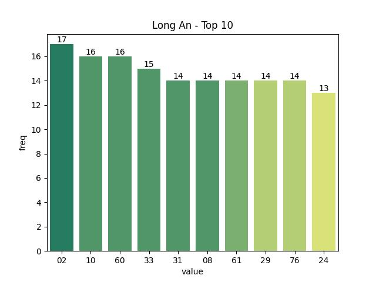

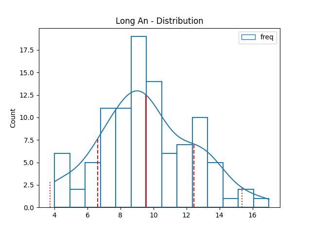

</details>

---

### Sóc Trăng (08-07-2026)

| Giải | Kết quả |
| :--- | :------ |
| Đặc biệt | **708297** |
| Giải nhất | 93546 |
| Giải nhì | 22596 |
| Giải ba | 75292, 42218 |
| Giải tư | 34254, 65279, 58378, 53818, 37095, 64652, 65183 |
| Giải năm | 03903 |
| Giải sáu | 6193, 8563, 1264 |
| Giải bảy | 916 |
| Giải tám | 48 |

<details>
<summary>Xem phân tích</summary>

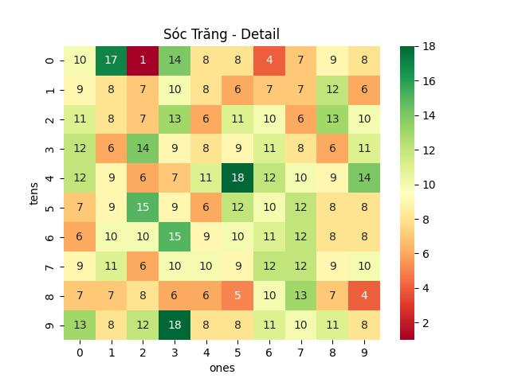

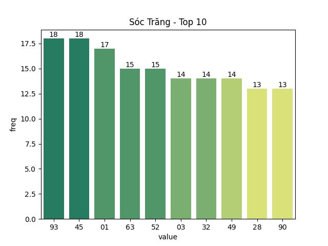

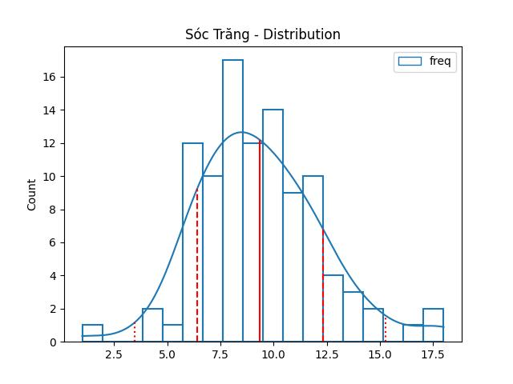

</details>

---

### TP. HCM (04-07-2026)

| Giải | Kết quả |
| :--- | :------ |
| Đặc biệt | **185542** |
| Giải nhất | 10124 |
| Giải nhì | 31285 |
| Giải ba | 38864, 73603 |
| Giải tư | 10817, 03857, 08323, 03793, 77113, 00517, 86435 |
| Giải năm | 07853 |
| Giải sáu | 7252, 8102, 2155 |
| Giải bảy | 817 |
| Giải tám | 98 |

<details>
<summary>Xem phân tích</summary>

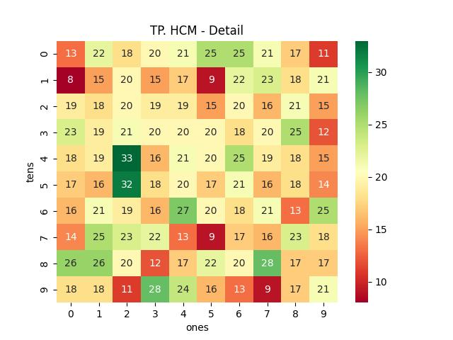

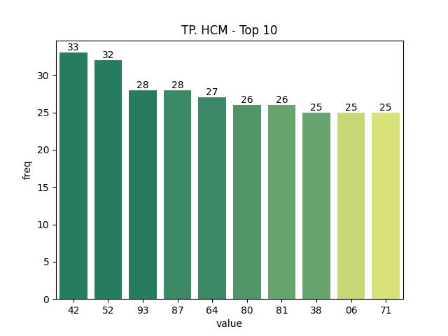

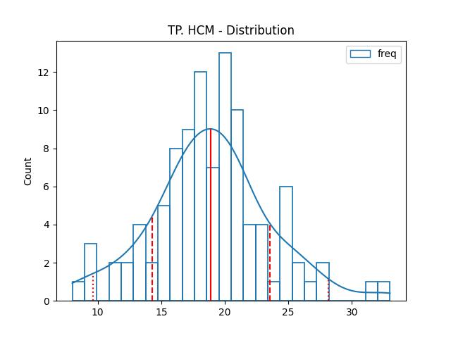

</details>

---

### Tiền Giang (12-07-2026)

| Giải | Kết quả |
| :--- | :------ |
| Đặc biệt | **898582** |
| Giải nhất | 11865 |
| Giải nhì | 22368 |
| Giải ba | 62096, 77715 |
| Giải tư | 91401, 31112, 32870, 82026, 82316, 80048, 37225 |
| Giải năm | 06522 |
| Giải sáu | 3841, 4469, 9759 |
| Giải bảy | 252 |
| Giải tám | 07 |

<details>
<summary>Xem phân tích</summary>

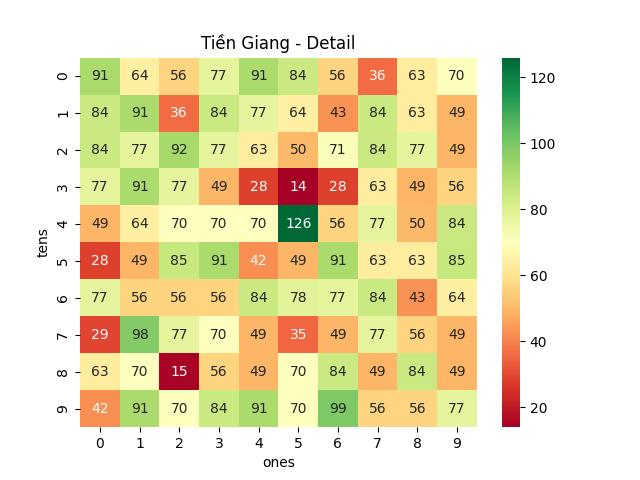

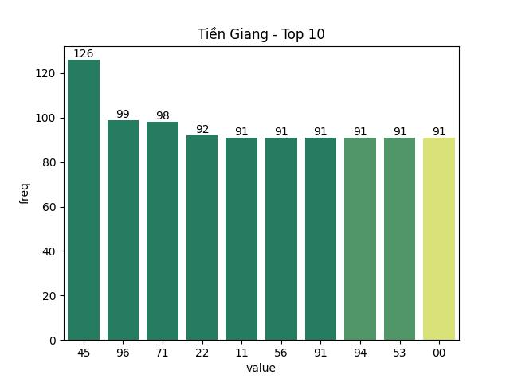

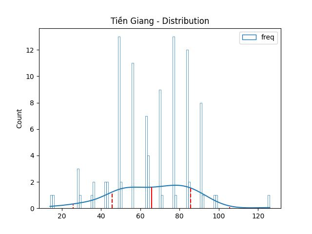

</details>

---

### Trà Vinh (10-07-2026)

| Giải | Kết quả |
| :--- | :------ |
| Đặc biệt | **325002** |
| Giải nhất | 44392 |
| Giải nhì | 78976 |
| Giải ba | 27148, 60269 |
| Giải tư | 59086, 07496, 83400, 23409, 59974, 72448, 78305 |
| Giải năm | 06982 |
| Giải sáu | 8085, 7124, 5351 |
| Giải bảy | 900 |
| Giải tám | 51 |

<details>
<summary>Xem phân tích</summary>

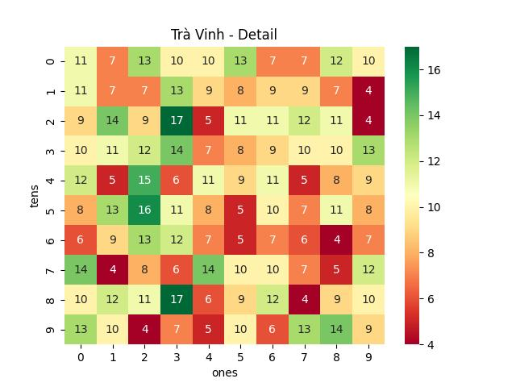

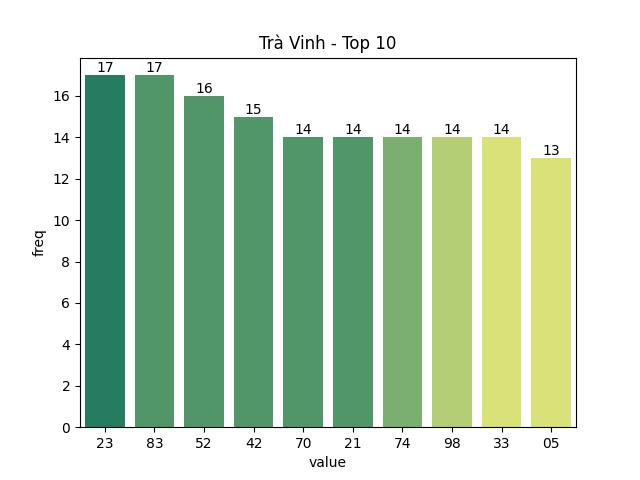

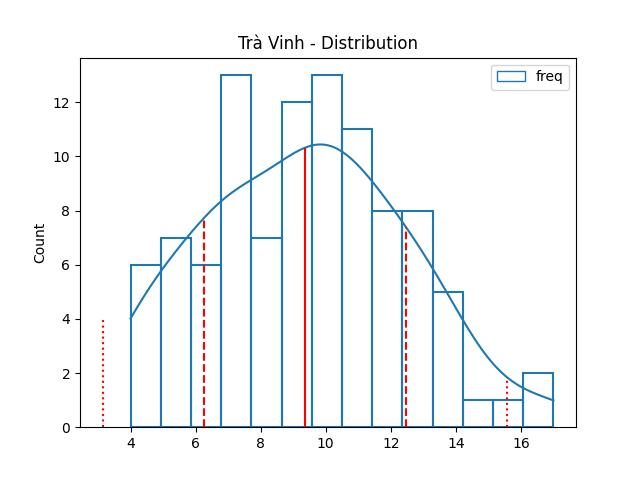

</details>

---

### Tây Ninh (09-07-2026)

| Giải | Kết quả |
| :--- | :------ |
| Đặc biệt | **306050** |
| Giải nhất | 50830 |
| Giải nhì | 91654 |
| Giải ba | 93553, 11469 |
| Giải tư | 95262, 57634, 26427, 83873, 17826, 08351, 08686 |
| Giải năm | 06573 |
| Giải sáu | 8610, 0724, 7486 |
| Giải bảy | 754 |
| Giải tám | 27 |

<details>
<summary>Xem phân tích</summary>

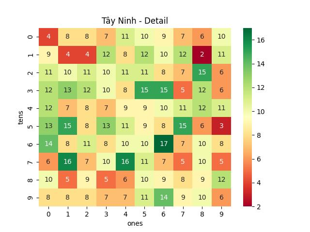

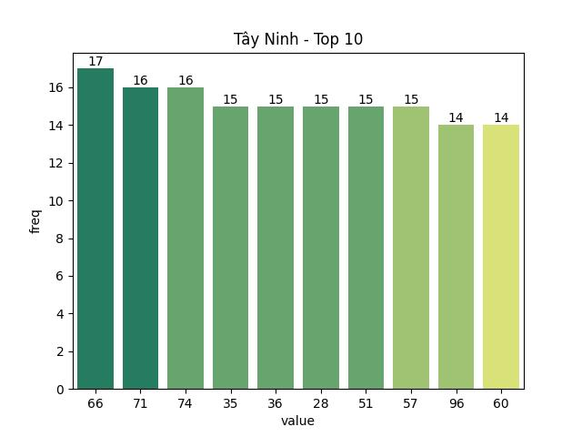

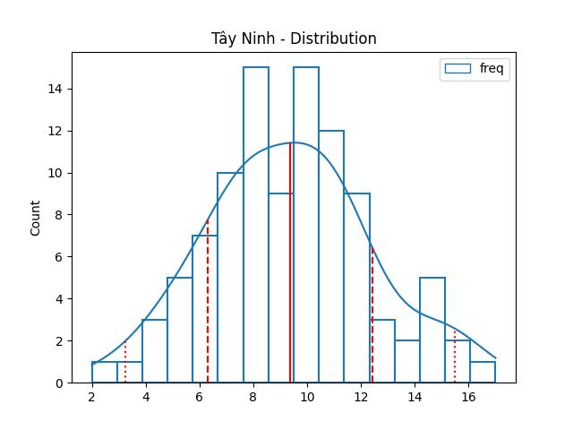

</details>

---

### Vĩnh Long (10-07-2026)

| Giải | Kết quả |
| :--- | :------ |
| Đặc biệt | **073565** |
| Giải nhất | 91553 |
| Giải nhì | 08409 |
| Giải ba | 05155, 43291 |
| Giải tư | 28647, 07105, 08241, 32095, 97330, 54446, 92219 |
| Giải năm | 08141 |
| Giải sáu | 1990, 3659, 5057 |
| Giải bảy | 095 |
| Giải tám | 95 |

<details>
<summary>Xem phân tích</summary>

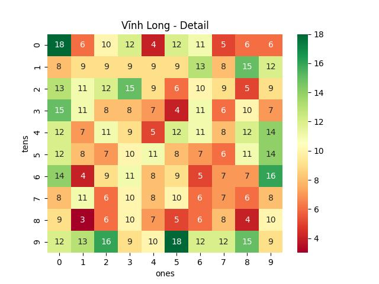

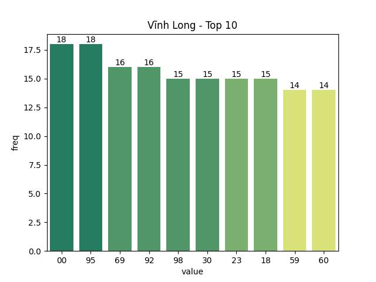

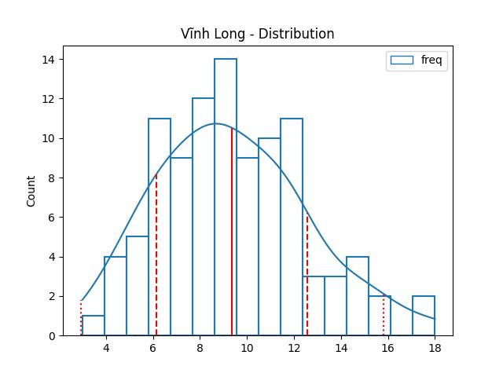

</details>

---

### Vũng Tàu (07-07-2026)

| Giải | Kết quả |
| :--- | :------ |
| Đặc biệt | **168986** |
| Giải nhất | 36041 |
| Giải nhì | 91832 |
| Giải ba | 61154, 98970 |
| Giải tư | 26316, 60123, 48489, 87993, 24265, 85456, 76916 |
| Giải năm | 01128 |
| Giải sáu | 5118, 1091, 1722 |
| Giải bảy | 077 |
| Giải tám | 18 |

<details>
<summary>Xem phân tích</summary>

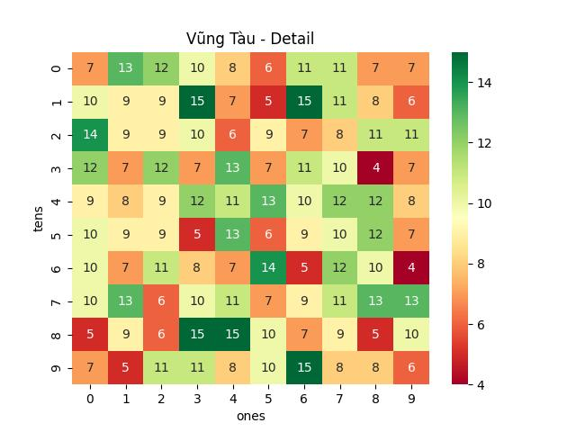

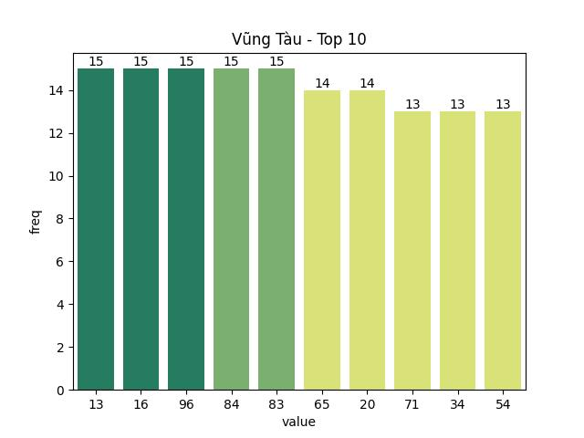

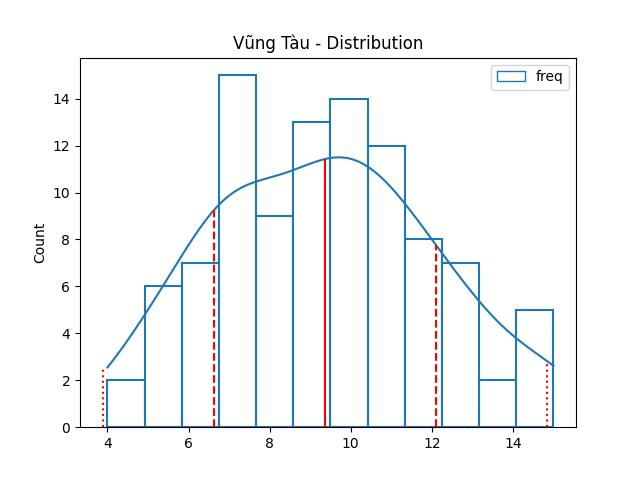

</details>

---

### Đà Lạt (28-06-2026)

| Giải | Kết quả |
| :--- | :------ |
| Đặc biệt | **635343** |
| Giải nhất | 49624 |
| Giải nhì | 88765 |
| Giải ba | 30446, 52689 |
| Giải tư | 58770, 14459, 90452, 29223, 05074, 60465, 00945 |
| Giải năm | 09976 |
| Giải sáu | 7944, 0026, 1675 |
| Giải bảy | 017 |
| Giải tám | 16 |

<details>
<summary>Xem phân tích</summary>

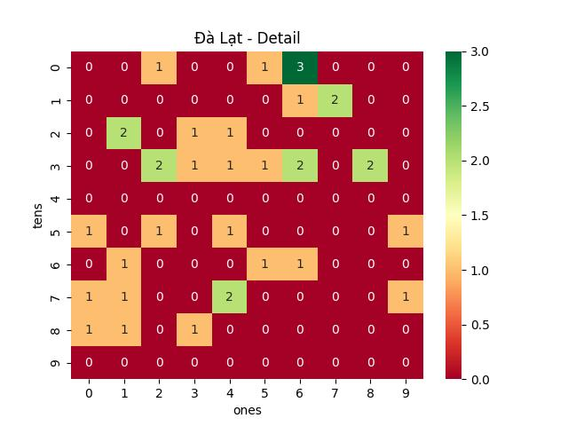

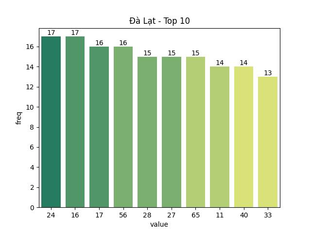

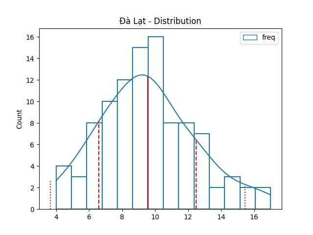

</details>

---

### Đồng Nai (08-07-2026)

| Giải | Kết quả |
| :--- | :------ |
| Đặc biệt | **061248** |
| Giải nhất | 40651 |
| Giải nhì | 53913 |
| Giải ba | 92425, 62190 |
| Giải tư | 48289, 10993, 90963, 35884, 10410, 97093, 32999 |
| Giải năm | 03402 |
| Giải sáu | 5837, 9611, 4288 |
| Giải bảy | 811 |
| Giải tám | 48 |

<details>
<summary>Xem phân tích</summary>

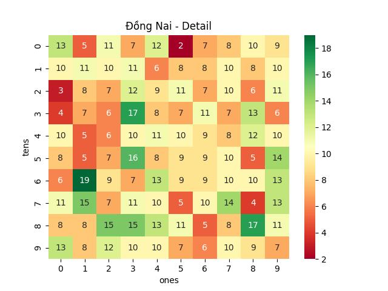

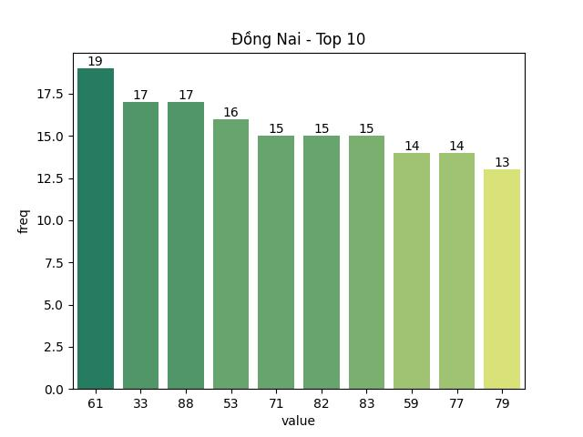

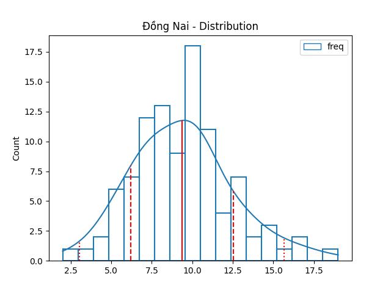

</details>

---

### Đồng Tháp (06-07-2026)

| Giải | Kết quả |
| :--- | :------ |
| Đặc biệt | **497852** |
| Giải nhất | 01422 |
| Giải nhì | 22357 |
| Giải ba | 27799, 45705 |
| Giải tư | 29880, 05713, 76396, 64836, 08839, 72144, 47838 |
| Giải năm | 01562 |
| Giải sáu | 4859, 4196, 7958 |
| Giải bảy | 642 |
| Giải tám | 27 |

<details>
<summary>Xem phân tích</summary>

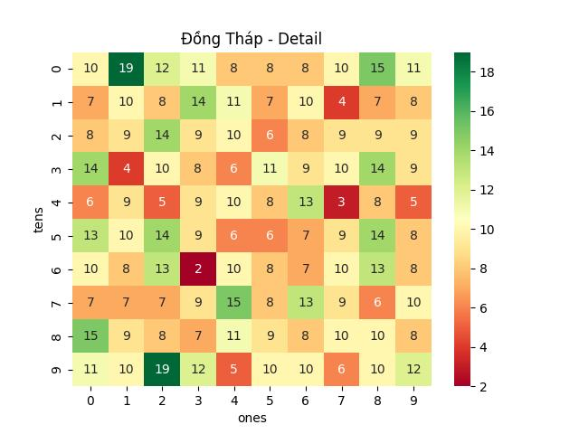

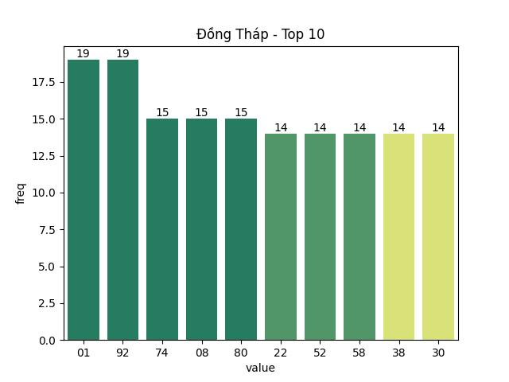

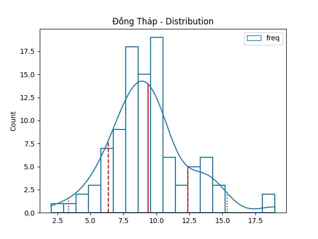

</details>

---


## Giải thích biểu đồ phân tích

Mỗi đài có **3 biểu đồ** phân tích tần suất xuất hiện của các cặp số (00-99) trong 1 năm:

### 1. Heatmap (Bản đồ nhiệt)

- Bảng 10x10, hàng = chữ số hàng chục (0-9), cột = chữ số hàng đơn vị (0-9)
- Mỗi ô hiển thị **số lần** cặp số đó xuất hiện trong 1 năm
- **Màu xanh** = xuất hiện ít, **màu đỏ** = xuất hiện nhiều

### 2. Top 10 (10 số xuất hiện nhiều nhất)

- Liệt kê 10 cặp số có tần suất xuất hiện cao nhất
- Trục ngang = cặp số (00-99), trục dọc = số lần xuất hiện

### 3. Distribution (Phân phối tần suất)

- Trục ngang = số lần xuất hiện, trục dọc = số lượng cặp số có tần suất đó
- Đường đỏ nét liền = **trung bình** (mean)
- Đường đỏ nét đứt = **độ lệch chuẩn** ±1σ
- Đường đỏ nét chấm = **±2σ**

## Cấu trúc giải thưởng XSMN

| Giải | Số chữ số | Số giải |
|------|----------|---------|
| Đặc biệt | 6 | 1 |
| Nhất | 5 | 1 |
| Nhì | 5 | 1 |
| Ba | 5 | 2 |
| Tư | 5 | 7 |
| Năm | 5 | 1 |
| Sáu | 4 | 3 |
| Bảy | 3 | 1 |
| Tám | 2 | 1 |